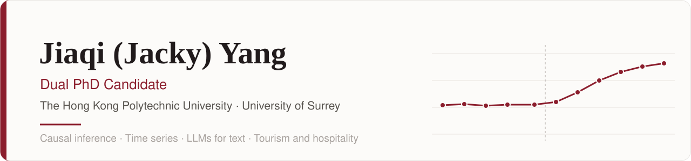

<picture>
  <source media="(prefers-color-scheme: dark)" srcset="assets/banner-dark.svg">
  
</picture>

  <a href="https://jackieyangjq.github.io"><b>Website</b></a> &nbsp;·&nbsp;
  <a href="https://jackieyangjq.github.io/files/Jiaqi_Yang_CV_Academic.pdf">Academic CV</a> &nbsp;·&nbsp;
  <a href="https://jackieyangjq.github.io/files/Jiaqi_Yang_CV_Industry.pdf">Industry CV</a> &nbsp;·&nbsp;
  <a href="https://www.linkedin.com/in/jiaqi-yang-7b8813326">LinkedIn</a> &nbsp;·&nbsp;
  <a href="mailto:jiaqi.yang@surrey.ac.uk">Email</a>
   
  <b>English</b> · <a href="README.zh-CN.md">简体中文</a>

I study how digital technology and public policy change tourism and hospitality markets, using causal inference, time-series models and large language models as measurement tools for text. I am on the 2026–27 job market for academic, research, data science and quantitative roles.

- Best Paper Awards at IATE 2026 and CHME 2026
- Papers in revision at *Annals of Tourism Research* and the *Journal of Travel Research*
- Open code for the methods I use, each checked on data where the answer is known

## Research methods in code

<table>
  <tr>
    <td width="33%" valign="top">
      
      
<b><a href="https://github.com/jackieyangjq/applied-stats-econometrics-toolkit">applied-stats-econometrics-toolkit</a></b> Statistics and econometrics I use in research, each checked on simulated data: staggered DiD, quantile regression with fixed effects, VAR, bounded-outcome models, change points.

    </td>
    <td width="33%" valign="top">
      
      
<b><a href="https://github.com/jackieyangjq/llm-text-measurement">llm-text-measurement</a></b> LLM labelling of 998 hotel reviews, validated six ways: 94.6% agreement with the guests' own liked/disliked split, alpha 0.93 against a second model, no false labels on controls.

    </td>
    <td width="33%" valign="top">
      
      
<b><a href="https://github.com/jackieyangjq/ml-inflation-forecasting">ml-inflation-forecasting</a></b> Machine-learning forecasts of US inflation from 121 FRED-MD series, replicating Medeiros et al. (2021). Tree models cut forecast error by 15-20% against an AR benchmark in 2001-2015, but not since 2020.

    </td>
  </tr>
</table>

## Tools and apps

| Project | What it is |
|---|---|
| **[filings-qa-agent](https://github.com/jackieyangjq/filings-qa-agent)** | Question answering over SEC filings with a checkable source for every sentence, a tool-using research agent, and a 50-question retrieval evaluation (keyword search 95% correct). |
| **[finfluencer-digest](https://github.com/jackieyangjq/finfluencer-digest)** | Daily digest of stock calls: Gemini watches 16 YouTube finance channels and X accounts, extracts each call and sums up the consensus. Multi-model fallback, scheduled runs, source-checked news. |
| **[catfolio fork](https://github.com/jackieyangjq/catfolio)** | Portfolio dashboard fork with broker sync and a tracker that scores stock calls against later prices. Four pull requests upstream. |
| **[Calorie tracker](https://github.com/jackieyangjq/caltrk)** · [live](https://jackieyangjq.github.io/caltrk/) | Offline web app that recognises food from photos with a vision model and calibrates calorie estimates against real weight data. 20 versions in seven weeks. |

## Open source

- [ClaudeCodeUsage](https://github.com/ClaudeCodeUsage/ClaudeCodeUsage) (VS Code extension, TypeScript): [#115](https://github.com/ClaudeCodeUsage/ClaudeCodeUsage/pull/115) cached the dashboard date-label formatter (fixes #99), merged September 2026.
- [catfolio](https://github.com/irrwood/catfolio) (FastAPI portfolio dashboard, Python): [#4](https://github.com/irrwood/catfolio/pull/4) HK ticker padding and HKD exchange rates, [#5](https://github.com/irrwood/catfolio/pull/5) dead links, [#6](https://github.com/irrwood/catfolio/pull/6) broker account sync, [#7](https://github.com/irrwood/catfolio/pull/7) call-tracker workspace; opened September 2026.
